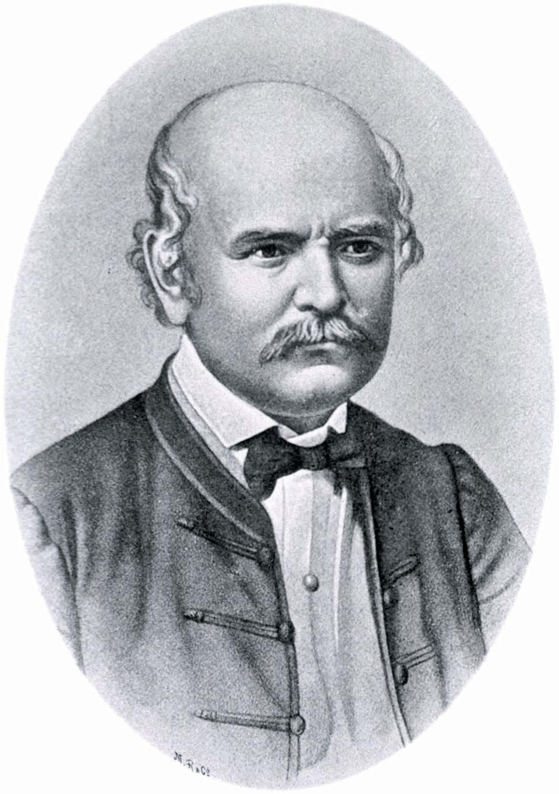

#  🧼 Dr. Semmelweis and the Discovery of Handwashing Importance

## ✨ Project Description

In 1847, the Hungarian physician Ignaz Semmelweis made a breakthrough discovery that revolutionized modern medicine: he discovered the importance of handwashing. Dr. Semmelweis realized that contaminated hands were a major cause of childbed fever, a deadly infection affecting women after childbirth. By enforcing handwashing practices at his hospital, he was able to save hundreds of lives and significantly reduce the mortality rate among his patients.

This project reanalyzes the historical data related to Dr. Semmelweis's groundbreaking discovery. Through data analysis and visualization, we aim to gain a deeper understanding of the impact of handwashing on patient outcomes and mortality rates. By exploring the data, we can uncover insights into the profound implications of simple hygiene practices in healthcare.

## 🎯Project Objectives

The primary objectives of this project are as follows:
- Analyze historical medical data to understand the significance of handwashing in preventing childbed fever.
- Visualize the data to illustrate the impact of handwashing on patient outcomes and mortality rates.
- Provide insights into the contributions of Dr. Ignaz Semmelweis to modern medicine.
